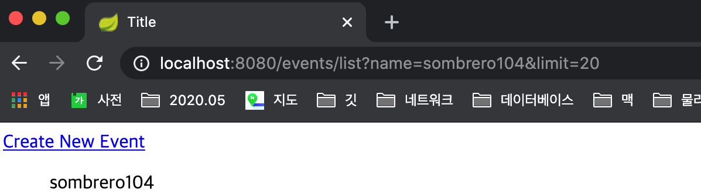

# 스프링 MVC 활용
 

# 요청 맵핑하기 
 

## HTTP Method
- GET, POST, PUT, PATCH, DELETE, ...

### GET 요청
- 클라이언트가 서버의 리소스를 요청할 때 사용한다.
- 캐싱 할 수 있다.  
    (조건적인 GET으로 바뀔 수 있다. 동일한 요청을 받았을 때 If-Modified-Since 시간을 보고 
    304 응답코드(Not Modified)와 함께 응답 본문을 다시 보내지 않아도  
    클라이언트가 캐시하고 있는 그 정보 그대로 클라이언트에서 보여줌. 
    요청 처리가 빠르고 서버쪽 리소스를 아낄 수 있음.) 
- 브라우저 기록에 남는다.
- 북마크 할 수 있다.
- 민감한 데이터를 보낼 때 사용하지 말 것. (URL에 다 보이니까)
- idempotent(멱등): 동일한 GET 요청은 항상 동일한 응답을 리턴해야 한다. 

### POST 요청
- 클라이언트가 서버의 리소스를 수정하거나 새로 만들 때 사용한다. (idempotent하지 않다.)
- 서버에 보내는 데이터를 POST 요청 본문에 담는다. 
- 캐시할 수 없다.
- 브라우저 기록에 남지 않는다.
- 북마크 할 수 없다.
- 데이터 길이 제한이 없다.

### PUT 요청
- URI에 해당하는 데이터를 새로 만들거나 수정할 때 사용한다.
- POST와 다른 점은 "URI"에 대한 의미가 다르다.
    - POST의 URI는 보내는 **_데이터를 처리할_** 리소스를 지칭하며,
    - PUT의 URI는 보내는 데이터에 해당하는 **_리소스 자체_** 를 지칭한다.
- idempotent(멱등): 동일한 PUT 요청은 항상 동일한 응답을 리턴해야 한다. 

### PATCH 요청
- PUT과 비슷하지만, 기존 엔티티와 새 데이터의 차이점만 보낸다는 차이가 있다.
- idempotent(멱등): 동일한 PATCH 요청은 항상 동일한 응답을 리턴해야 한다. 

### DELETE 요청
- URI에 해당하는 리소스를 삭제할 때 사용한다.
- idempotent(멱등): 동일한 DELETE 요청은 항상 동일한 응답을 리턴해야 한다. 
    

# URI 패턴 맵핑

### URI, URL, URN ???
 
- URI (Uniform Resource Identifier)
- URL (Uniform Resource Locator)
- URN (Uniform Resource Name) 

https://stackoverflow.com/questions/176264/what-is-the-difference-between-a-uri-a-url-and-a-urn  
 

## 요청 식별자로 맵핑하기
- @RequestMapping은 다음의 패턴을 지원한다.
- ?: 한 글자 ("/author/???" => "/author/123")
- \*: 여러 글자 ("/author/*" => "/author/sombrero104")
- \*\*: 여러 패스 ("/author/\*\*" => "/author/sombrero104/book")
- /{name:정규식}: 정규표현식 맵핑. (@GetMapping("/{name:\[a-z]+}"))

## 패턴이 중복되는 경우에는?
- 가장 구체적으로 맵핑되는 핸들러를 선택한다. ('/**' 보다는 '/구체적인경로'로 맵핑됨.)

## URI 확장자 맵핑 지원
- @GetMapping("/sombrero") 설정을 하면 
스프링 MVC가 암묵적으로 @GetMapping({"/sombrero", "/sombrero.*"})로 설정을 해준다. 
'sombrero.json', 'sombrero.xml', 'sombrero.html', 'sombrero.zip' 요청도 처리할 수 있게끔.. 
하지만 스프링부트는 기본적으로 이 기능을 사용하지 않도록 설정되어 있다. (보안 이슈가 있어서..) 
- 이 기능은 권장하지 않는다. (스프링 부트에서는 기본으로 이 기능을 사용하지 않도록 설정해줌.)
    - 보안 이슈(RFD Attack (Reflected File Down Attack))  
    https://www.trustwave.com/en-us/resources/blogs/spiderlabs-blog/reflected-file-download-a-new-web-attack-vector/
    - URI 변수, Path 매개변수, URI 인코딩을 사용할 때 불명확함. 
       (확장자인지 어떤 용도인지 모호함. 
       예전에는 응답으로 어떤 타입을 원하는지를 확장자로 사용하기도 했었는데,  
       최근에는 서버가 알아서 판단하는 Accept 헤더로 사용하는 추세. 
       헤더에 값을 보내는 것이 불편한 상황이라면 파라미터로 사용 권장.) 
   

# 미디어 타입 맵핑

### 특정한 타입의 데이터를 담고 있는 요청만 처리하는 핸들러
- @RequestMapping(consumes=MediaType.APPLICATION_JSON_UTF8_VALUE)
- @RequestMapping(consumes="application/json")
- Content-Type 헤더로 필터링.
- 매치되지 않는 경우에 415(Unsupported Media Type) 응답.

### 특정한 타입의 응답을 만드는 핸들러
- @RequestMapping(produces=MediaType.APPLICATION_JSON_UTF8_VALUE)
- @RequestMapping(produces="application/json")
- Accept 헤더로 필터링. (Accept를 아예 설정하지 않은 경우에도 응답.)
- 매치되지 않는 경우에 406(Not Acceptable) 응답. 

### * 클래스에 선언한 @RequestMapping에 사용한 것과 조합이 되지 않고, 메소드에 사용한 @RequestMapping의 설정으로 덮어쓴다. 
### * Not (!)을 사용해서 특정 미디어 타입이 아닌 경우로 맵핑 할 수도 있다. 
<pre>
@GetMapping(value = "/hello", headers = "!" + HttpHeaders.AUTHORIZATION)
</pre>
 

## 헤더와 매개변수
- 특정한 헤더가 있는 요청을 처리하고 싶은 경우
    - @RequestMapping(headers = "key")
- 특정한 헤더가 없는 요청을 처리하고 싶은 경우
    - @RequestMapping(headers = "!key")
- 특정한 헤더 키값이 있는 요청을 처리하고 싶은 경우
    - @RequestMapping(headers = "key=123")
- 특정한 요청 매개변수 키를 가지고 있는 요청을 처리하고 싶은 경우
    - @RequestMapping(params = "name")
- 특정한 요청 매개변수가 없는 요청을 처리하고 싶은 경우
    - @RequestMapping(params = "!name")
- 특정한 요청 매개변수 키값을 가지고 있는 요청을 처리하고 싶은 경우
    - @RequestMapping(params = "name=123")
 

## HEAD와 OPTIONS 요청 처리
우리가 구현하지 않아도 스프링 웹 MVC에서 자동으로 처리하는 HTTP Method.
### HEAD
- GET 요청과 동일하지만 응답 본문(body)을 받아오지 않고 **_응답 헤더만_** 받아온다.
- 리소스를 받기 전에 사전에 리소스에 대한 정보를 확인하기 위해 사용.
### OPTIONS
- 서버 또는 특정 리소스가 제공하는 기능을 확인할 수 있다.
- 해당 서버가 살아있는지 해당 리소스에 대한 요청을 처리할 수 있는지 확인할 수 있다. 
- 사용할 수 있는 HTTP Method 제공.
- 서버는 Allow 응답 헤더에 사용할 수 있는 HTTP Method 목록을 제공해야 한다.
  

## 커스텀 애노테이션
### 메타(Meta) 애노테이션
- 애노테이션에 사용할 수 있는 애노테이션.
- 스프링이 제공하는 대부분의 애노테이션은 메타 애노테이션으로 사용할 수 있다.
### 조합(Composed) 애노테이션
- 한개 혹은 여러 메타 애노테이션을 조합해서 만든 애노테이션.
- 코드를 간결하게 줄일 수 있다.
- 보다 구체적인 의미를 부여할 수 있다.
### @Retention
- 해당 애노테이션 정보를 언제까지 유지할 것인가. 디폴트는 Class. (자바의 RetentionPolicy)
- Source: 소스 코드까지만 유지. 즉, 컴파일하면 해당 애노테이션 정보는 사라진다.
- Class: 컴파일한 .class 파일에도 유지. 즉, 런타임 시 클래스를 메모리로 읽어오면 해당 정보는 사라진다.
- Runtime: 클래스를 메모리에 읽어왔을 때까지 유지! 코드에서 이 정보를 바탕으로 특정 로직을 실행할 수 있다. 
    자바의 기본 RetentionPolicy는 Class인데, 스프링에서는 모든 구성이 런타임 때 형성되기 때문에 
    스프링에서 커스텀 애노테이션을 만들때에는 꼭 @Retention을 Runtime으로 설정해줘야 한다.  
    그냥 주석 정도의 역할로 사용하고 싶을 때에는 Source를 사용해도 된다.  
### @Target
- 해당 애노테이션을 어디에 사용할 수 있는지 결정한다.
### @Document
- 해당 애노테이션을 사용한 코드의 문서에 그 애노테이션에 대한 정보를 표기할지 결정한다. 
- 예를 들어, 커스텀 애노테이션 @GetHelloMapping를 만들고, 
    이 애노테이션의 메타 애노테이션으로 @Document를 설정한 후, 
    이 애노테이션을 EventController에 있는 핸들러에서 사용하도록 작성하면, 
    EventController에 대한 javadoc을 만들 때 해당 핸들러 부분에 
    커스텀 애노테이션인 @GetHelloMapping까지 표기가 된다.  
  
   

# 핸들러 메소드 
 

## 요청 매개변수 
아래 두 경우를 서블릿은 요청 매개변수로 처리를 한다. (사실상 서블릿은 둘 다 동일하게 봄.) 
- 쿼리 매개변수
    - Key/Value에 해당하는 데이터를 쿼리 파라미터로 보내는 것.
    - '/events?name=sombrero104'
- 폼 데이터
    - HTTP 요청 본문에 form 데이터로 보내는 경우. 
 
    
## @RequestParam
핸들러에 @RequestParam을 설정해서 요청 매개변수(파라미터)를 받음.  
@RequestParam 애노테이션을 생략할 수도 있으나, 헷갈릴 수도 있기 때문에 생략하지 않는 것을 권장.  
<pre>
@RequestParam(required = true) String name
</pre>
위 처럼 required 옵션은 기본적으로 true임. 
<pre>
@RequestParam(required = false, defaultValue = "sombrero104") String name
</pre>
위 처럼 해당 파라미터 값이 없어도 되고, 없는 경우에는 기본값으로 'sombrero104'를 쓰겠다고 할수도 있음.  
<pre>
@RequestParam(value = "name", required = false, defaultValue = "sombrero104") String nameValue
</pre>
위 처럼 파라미터 변수명이 다를 경우 value에 이름을 줄수도 있음. (하지만 그냥 파라미터명과 변수명을 같게 하는 것을 권장.) 
  

### * 타임리프 표현식 
- @{}: 링크 URL 표현식.
- ${}: variable 표현식. (자원)
- *{}: selection 표현식. (위 자원에서 선택한 것.)

https://www.thymeleaf.org/doc/articles/standarddialect5minutes.html  
  

## @ModelAttribute
- 여러 곳에 있는 단순 타입 데이터를 복합 타입 객체로 받아오거나 해당 객체를 새로 만들 때 사용할 수 있다.
- 서블릿에서는 요청 매개변수를 받아오는 방법들에 대해 동일하게 판단하기 때문에..
- URI 패스, 요청 매개변수, 세션 등 여러곳의 데이터를 하나의 복합 객체로 받아올 수 있어서 편리하다. 
- @ModelAttribute 애노테이션을 생략할 수 있다. 
- 값을 바인딩 할 수 없는 경우에는?  
(예를 들어, 받아와야 하는 매개변수 타입이 Integer로 선언되어 있는데 문자열이 들어왔을 경우)
    - 400 에러 BindException 발생.
- 바인딩 에러를 직접 다루고 싶은 경우, ('당신이 폼에 입력한 이러이러한 값이 잘못되었다.'라고 보여주고 싶을 경우 사용.)
    - BindingResult 타입의 아규먼트를 바로 오른쪽에 추가한다. 
    <pre>
    public Event getEvents(@ModelAttribute Event event, BindingResult bindingResult) { ... }
    </pre>
    - 이렇게 선언하면 bindingResult 변수에 바인딩 관련 에러를 담아주고, 요청은 정상적으로 처리된다. 
 

## @Valid
- 바인딩 이후(바인딩은 정상적으로 수행되었지만)에 검증 작업을 추가로 하고 싶은 경우 사용. 
- @Valid에서 발생한 에러 역시 bindingResult에 담아준다. 
<pre>
public Event getEvents(@Valid @ModelAttribute Event event, BindingResult bindingResult) { ... }
</pre>
<pre>
public class Event {
    @Min(0) // 인원수 값을 넣을 때 최소 0명 이상은 되어야 한다고 알려줌. @Valid에서 검증함.
    private Integer limit;
    ...
}
</pre>
<pre>
mockMvc.perform(post("/events")
        .param("name", "sombrero104")
        .param("limit", "-10")) // @Valid 테스트. 마이너스 인원을 준 경우. 
        .andDo(print())
        .andExpect(status().isOk())
        .andExpect(jsonPath("name").value("sombrero104"));
</pre>
- bindingResult에 에러가 담겨지며, 응답은 정상적으로 200 응답코드이고, limit의 값은 -10이 나온다. 
 

## @Validated
- @Valid처럼 검증도 가능하고, 덧붙여 그룹을 지정할 수 있다. 
<pre>
public class Event {
    interface ValidateName {}
    interface ValidateLimit {}

    @NotBlank(groups = ValidateName.class)
    private String name;
    
    @Min(value = 0, groups = ValidateLimit.class)
    private Integer limit;
    ...
}
</pre>
<pre>
public Event getEvents(@Validated(Event.ValidateLimit.class) 
    @ModelAttribute Event event, BindingResult bindingResult) { ... }
</pre>
 

## @Validated, BindingResult, 타임리프로 Form 값 검증
<pre>
@PostMapping("/events")
public String getEvents(@Validated @ModelAttribute Event event, BindingResult bindingResult) {
    if(bindingResult.hasErrors()) { // bindingResult에 에러가 있으면..
        return "/events/form"; // form 페이지로.. 
    }
    return "/events/list";
}
</pre>
<pre>
public class Event {
    @NotBlank
    private String name;
    
    @Min(0)
    private Integer limit;
    ...
}
</pre>
<pre>
❮form action="#" th:action="@{/events}" method="post" th:object="${event}"❯
    ❮p th:if="${#fields.hasErrors('name')}" th:errors="*{name}"❯Incorrect name❮/p❯ // name 관련된 에러가 있으면..
    ❮p th:if="${#fields.hasErrors('limit')}" th:errors="*{limit}"❯Incorrect limit❮/p❯ // limit 관련된 에러가 있으면.. 
    ❮input type="text" title="name" th:field="*{name}" /❯
    ❮input type="text" title="limit" th:field="*{limit}" /❯
    ❮input type="submit" value="Create" /❯
❮/form❯
</pre>
실행한 후 폼 값을 잘못 입력하면, 아래와 같이 타임리프에서 제공하는 메세지가 자동으로 출력된다.  
 
  

## @SessionAttributes
모델 정보를 HTTP 세션에 저장해주는 애노테이션.   
(이 애노테이션이 설정된 해당 클래스 안에서만 @SessionAttributes에 정의한 이름에 대한 모델을 저장해줌..)  
- HttpSession을 직접 사용할 수도 있지만..
- 이 애노테이션에 설정한 이름에 해당하는 모델 정보를 자동으로 세션에 넣어준다. 
- @ModelAttribute는 세션에 있는 데이터도 바인딩한다.
- 여러 화면(또는 요청)에서 사용해야 하는 객체를 공유할 때 사용한다.
- SessionStatus를 사용해서 세션 처리 완료를 알려줄 수 있다.
    - 폼 처리 끝나고 세션을 비울 때 사용한다.
<pre>
@SessionAttributes({"event"})
public class EventController {

    @GetMapping("/events/form")
    // public String eventsForm(Model model, HttpSession httpSession) {
    public String eventsForm(Model model) {
        // Form Backing Object
        // 폼에 채워질 데이터를 받아오는 객체를 제공.
        Event newEvent = new Event();
        newEvent.setLimit(50);
        model.addAttribute("event", newEvent);
        // httpSession.setAttribute("event", newEvent); // 세션에 event 저장하기.
        /**
         * 위 처럼 'httpSession.setAttribute("event", newEvent);'로 작성하지 않아도
         * (HttpSession을 인자로 받아서 사용하는 것은 로우레벨..)
         * 컨트롤러에 애노테이션 '@SessionAttributes({"event"})'를 설정하면
         * 'event' 이름에 해당하는 모델 애트리뷰트를 세션에 자동으로 저장해 준다.
         *
         * 'model.addAttribute("event", newEvent);' 처럼 모델 애트리뷰트에 추가된,
         * 모델 애튜리뷰트에 있는 애튜리뷰트들 중에 
         * @SessionAttributes에 있는 이름과 같은 애트리뷰트를 세션에도 저장한다.
         *
         * 세션에 데이터를 넣는 이유?
         * 여러 페이지에서 유지되어야 하는 정보인 장바구니 기능과 같은 경우나,
         * 또는 어떤 데이터를 생성할 때 여러 페이지에 걸쳐서 만들어야 하는 경우,
         * 입력받아야 하는 값이 많아서 여러 화면(페이지)에 나눠서 폼을 만들어야 하는 경우,
         * (@ModelAttribute는 세션에 있는 데이터도 바인딩한다.)
         *
         */
        return "events/form";
    }
    
    @PostMapping("/events")
    public String createEvents(@Validated @ModelAttribute Event event,
                               BindingResult bindingResult, SessionStatus sessionStatus) {
        ...
        sessionStatus.setComplete(); // 폼 처리가 끝났을 때 세션이 만료되도록 함. (세션을 비우도록 함.)
        ...
    }
}
</pre>
  

## 멀티 폼 서브밋
세션을 사용해서 여러 폼에 걸쳐 데이터를 나눠 입력 받고 저장하기.
- 예를 들어.. 
- 첫번째 페이지에서 이벤트 이름 입력 받고 서브밋, (model에 저장하면 세션에도 저장.)
- 두번째 페이지에서 이벤트 제한 인원 입력 받고 서브밋, (model에 저장하면 세션에도 저장.)
- 마지막으로 세션을 비우고, 이벤트 목록으로 돌아가기. 
<pre>
/**
 * [멀티 폼 서브밋]
 * 세션을 사용해서 여러 폼에 걸쳐 데이터를 나눠 입력 받고 저장하기.
 * - 첫번째 페이지에서 이벤트 이름 입력 받고 서브밋, 
 * - 두번째 페이지에서 이벤트 제한 인원 입력 받고 서브밋, 
 * - 마지막으로 이벤트 목록으로 돌아가기. 
 */

/**
 * name 값만 받는 form
 */
@GetMapping("/events/form/name")
public String eventsFormName(Model model) {
    model.addAttribute("event", new Event());
    // @SessionAttributes({"event"}) 설정으로 인해 위 medel에 저장된 event가 세션에도 들어감.
    // 때문에 form-name 페이지에서 값을 수정하면 세션에도 동일하게 적용됨.
    return "events/form-name";
}

/**
 * @ModelAttribute가 세션에 있는 정보도 바인딩 받기 때문에
 * form-name 페이지에서 수정한 후 모델에 저장했던 event도 세션에 들어있기 때문에 바인딩함.
 */
@PostMapping("/events/form/name")
public String createEventsNameSubmit(
                @Validated @ModelAttribute Event event, // @ModelAttribute가 세션에 있는 정보도 바인딩 받음.
                           BindingResult bindingResult) {
    if(bindingResult.hasErrors()) { // bindingResult에 에러가 있으면..
        return "/events/form-name"; // form-name 페이지로..
    }
    // name 값을 입력받는 form 페이지 에서 name 값을 받고,
    // 별 문제가 없으면 (에러가 없으면)
    // 아래처럼 이번엔 limit을 입력받는 form 페이지로 이동하게 한다.
    return "redirect:/events/form/limit"; // limit을 입력받는 form 페이지.
}

/**
 * limit 값만 받는 form
 * @ModelAttribute로 세션에 있는 event를 가져온다.
 */
@GetMapping("/events/form/limit")
public String eventsFormLimit(@ModelAttribute Event event, Model model) { // @ModelAttribute로 세션에 있는 event를 가져온다.
    model.addAttribute("event", event); // 세션에서 받은 event를 그대로 전달.
    // @SessionAttributes({"event"}) 설정으로 인해 위 medel에 저장된 event가 세션에도 들어감.
    // 때문에 form-limit 페이지에서 값을 수정하면 세션에도 동일하게 적용됨.
    return "events/form-limit";
}

/**
 * @ModelAttribute가 세션에 있는 정보도 바인딩 받기 때문에
 * form-limit 페이지에서 수정한 후 모델에 저장했던 event도 세션에 들어있기 때문에 바인딩함.
 */
@PostMapping("/events/form/limit")
public String createEventsLimitSubmit(
        @Validated @ModelAttribute Event event, // @ModelAttribute가 세션에 있는 정보도 바인딩 받음.
        BindingResult bindingResult,
        SessionStatus sessionStatus) {
    if(bindingResult.hasErrors()) { // bindingResult에 에러가 있으면..
        return "/events/form-limit"; // form-limit 페이지로..
    }
    // limit 값을 입력받는 form 페이지 에서 name 값을 받고,
    // 별 문제가 없으면 (에러가 없으면)
    // 세션에 있는 정보를 지워주고..
    sessionStatus.setComplete(); // 세션 비우기.

    // 마지막으로 list 페이지를 보여줌.
    return "redirect:/events/list"; // list 페이지를 보여줌.
}

@GetMapping("/events/list")
public String getEvents(Model model) {
    Event event = new Event();
    event.setName("sombrero104");
    event.setLimit(10);

    List❮Event❯ eventList = new ArrayList❮❯();
    eventList.add(event);
    model.addAttribute("eventList", eventList);

    return "/events/list";
}
</pre>
  

## @SessionAttribute
@SessionAttributes와는 완전히 다른 기능이다. (s가 안붙음! 헷갈림 주의!)  

## "@SessionAttributes"  vs  "@SessionAttribute"
@SessionAttributes와의 다른점은..  
@SessionAttributes는 애노테이션의 정의된 해당 클래스 내에서만 적용이 된다.   
(@SessionAttributes는 해당 클래스 내에서만 모델에 있는 정보를 세션에 저장해줌.)  
@SessionAttributes는 여러 컨트롤러에 걸쳐서 적용해주거나 하지 않는다.   
만약, 컨트롤러 밖에서 서블릿 필터나.. 스프링이 제공하는 인터셉터 같은 곳에서..   
세션에 뭔가를 넣어 놓았을 경우, 그것을 가져와서 쓰고 싶은 경우, @SessionAttribute를 사용할 수 있다.   
  

## RedirectAttributes
### RedirectAttributes 사용 전 (model 사용 방법.)
리다이렉트 할 때 기본적으로 Model에 들어있는 primitive type 데이터는 URI 쿼리 매개변수에 추가된다.  
- 스프링 부트에서는 이 기능이 기본적으로 비활성화 되어 있다. 
- Ignore-default-model-on-redirect 프로퍼티를 사용해서 활성화 할 수 있다. 
<pre>
@PostMapping("/events/form/limit")
public String createEventsLimitSubmit(..., Model model) {
    ...
    model.addAttribute("name", event.getName());
    model.addAttribute("limit", event.getLimit());
    ...
    return "redirect:/events/list"; // list 페이지로 리다이렉트. 
}
</pre>
위 처럼 model 애트리뷰트에 데이터를 추가한 후, 
아래와 같이 application.properties에 Ignore-default-model-on-redirect 프로퍼티를 false 한다.  
(스프링부트에서 기본적으로 무시하는(비활성화된) 것을 끈다.)  
<pre>
spring.mvc.ignore-default-model-on-redirect=false
</pre>
웹 애플리케이션을 실행 후 list 페이지로 리다이렉트 하면 아래와 같이 URI 뒤에 파라미터가 붙는 것을 확인할 수 있다.   

### RedirectAttributes 사용 후 
원하는 값만 리다이렉트 할 때 전달하고 싶다면 RedirectAttributes에 명시적으로 추가할 수 있다.  
(위의 model 같은 경우에는 이 같은 리다이렉트 용도외에도 쓰이므로,  
리다이렉트 용도로만 쓰고 싶은 경우에 쓸 수 있도록 RedirectAttributes를 사용하는 것 같다.)  
우선, 위에서 application.properties에 Ignore-default-model-on-redirect 프로퍼티를 false로 설정한 것을 다시 없앤다.  
<pre>
@PostMapping("/events/form/limit")
public String createEventsLimitSubmit(..., RedirectAttributes attributes) { // RedirectAttributes로 URI 쿼리 매개변수 추가
    ...
    attributes.addAttribute("name", event.getName()); // RedirectAttributes로 URI 쿼리 매개변수 추가
    attributes.addAttribute("limit", event.getLimit()); // RedirectAttributes로 URI 쿼리 매개변수 추가
    // 원래는 id만 list에 넘겨서 새로 추가된 정보만 하이라이트해서 보여주는 식으로 사용.
    ...
    return "redirect:/events/list"; // list 페이지로 리다이렉트. 
}
</pre>
리다이렉트 요청을 처리하는 곳에서 쿼리 매개변수를 @RequestParam 또는 @ModelAttribute로 받을 수 있다. 
<pre>
@GetMapping("/events/list")
// public String getEvents(@RequestParam String name, @RequestParam Integer limit, // 위 메소드에서 RedirectAttributes에 추가한 쿼리 매개변수 가져오기.
//                        Model model, @SessionAttribute LocalDateTime visitTime) {
// @ModelAttribute를 통해 위에서 RedirectAttributes에 추가한 쿼리 매개변수를 가져온다.
// 이때, 세션에 지정한 이름과 같게 지정하면 세션에서 evnet를 들고 오려고 하는데,
// 위에서 세션을 비웠으므로 세션에는 event가 없는 상태이다. 그래서 오류가 발생한다.
// 세션에서 들고 오지 않고 URI에 붙은 쿼리 파라미터 값을 들고 오려면 아래처럼 세션에 지정한 이름과 다르게 주면 된다.
public String getEvents(@ModelAttribute("newEvent") Event event,
                         Model model, @SessionAttribute LocalDateTime visitTime) {
     ...
    // Event newEvent = new Event();
    // newEvent.setName(name);
    // newEvent.setLimit(limit);

    Event event2 = new Event();
    event2.setName("sombrero104");
    event2.setLimit(10);

    List❮Event❯ eventList = new ArrayList❮❯();
    eventList.add(event2);
    eventList.add(event);
    model.addAttribute("eventList", eventList);

    return "/events/list";
}
</pre>
하지만 이 방법은 URI 쿼리 파라미터(매개변수)로 보내기 때문에 꼭 문자열로 변환이 되어야 한다. 
(String으로 변환이 가능한 값이어야 한다.) 
복합적인 객체로 전달하기는 어렵다는 점이 있다.  
  

## Flash Attributes
주로 리다이렉트 시에 데이터를 전달할 때 사용한다. 
- 데이터가 URL에 노출되지 않는다.
- 임의의 **_객체_** 를 저장할 수 있다.
- 보통 HTTP 세션을 사용한다.

리다이렉트 하기 전에 데이터를 HTTP 세션에 저장하고, 
리다이렉트 요청을 처리한 다음 그 즉시 제거한다. 
리다이렉트된 곳에서 데이터가 사용되면, (리다이렉트 요청 후 처리가 되면) 
이 세션에 있는 데이터는 제거가 된다. (일회성 데이터라고 할 수 있다. 그래서 이름이 flash..) 
HTTP 세션을 통해 데이터가 전달되기 때문에 URI 경로에 데이터가 노출되지 않는다.  

<pre>
@PostMapping("/events/form/limit")
public String createEventsLimitSubmit(
        @Validated @ModelAttribute Event event,
        ..., RedirectAttributes attributes) {
    ...
    attributes.addFlashAttribute("newEvent", event); // FlashAttributes 사용. 이 객체는 세션에 들어간다.
    ...
    return "redirect:/events/list"; // list 페이지로 리다이렉트. 
}
</pre>
<pre>
@GetMapping("/events/list")
// FlashAttributes로 넣은 데이터를 @ModelAttribute("newEvent")로도 가져올 수 있고.. 
// public String getEvents(@ModelAttribute("newEvent") Event event,
//                   Model model, @SessionAttribute LocalDateTime visitTime) {
// FlashAttributes로 넣은 데이터를 @ModelAttribute("newEvent")가 아닌 그냥 model로도 가져올 수 있다.
public String getEvents(Model model, @SessionAttribute LocalDateTime visitTime) {
    Event event2 = new Event();
    event2.setName("sombrero104");
    event2.setLimit(10);

    // FlashAttributes로 넣은 데이터를 @ModelAttribute("newEvent")가 아닌 그냥 model로도 가져올 수 있다.
    Event newEvent = (Event) model.asMap().get("newEvent");

    List❮Event❯ eventList = new ArrayList<>();
    eventList.add(event2);
    eventList.add(newEvent);
    model.addAttribute("eventList", eventList);

    return "/events/list";
}
</pre>
아래와 같이 테스트할 수 있다. 
<pre>
/**
 * list 페이지를 요청하면서 세션 애튜리뷰트에는 visitTime을 넣고, flash 애트리뷰트에는 event 객체를 넣어서 테스트한다.
 */
@Test
public void getEvents() throws Exception {
    Event newEvent = new Event();
    newEvent.setName("Winter is coming.");
    newEvent.setLimit(10000);

    mockMvc.perform(get("/events/list")
        .sessionAttr("visitTime", LocalDateTime.now())
        .flashAttr("newEvent", newEvent))
            .andDo(print())
            .andExpect(status().isOk())
            .andExpect(xpath("//p").nodeCount(2)); // '❮p❯❮/p❯ 노드는 2개일 것이다.'라는 의미.
            // xpath에 대한 참고.
            // 􏰒􏰅􏰅https://www.w3schools.com/xml/xpath_syntax.asp
}
</pre>
  

## MultipartFile
- 파일 업로드 시 사용하는 메소드 아규먼트. 
- MultipartResolver 빈이 설정되어 있어야 사용할 수 있다. (스프링 부트 자동 설정이 해줌.)
- POST multipart/form-data 요청에 들어있는 파일을 참조할 수 있다. 
- List<MultipartFile> 아규먼트로 여러 파일을 참조할 수도 있다. 

스프링부트에서는..  
스프링부트에서 자동설정할 때 참조되는 spring.factories를 보면 MultipartAutoConfiguration를 설정하는데, 
MultipartAutoConfiguration 코드를 보면, 
프로퍼티(application.properties)에서 prefix가 'spring.servlet.multipart'인 프로퍼티를 들고 와서 설정하는 것을 알 수 있다.  
(MultipartFile 관련 설정을 변경하고 싶은 경우,  
application.properties파일에 prefix가 'spring.servlet.multipart'인 속성을 추가하면 된다는 의미.) 
그리고 이 클래스에서 multipartResolver 빈을 생성하는 것을 확인할 수 있다. 
<pre>
@Bean(name = {"multipartResolver"})
@ConditionalOnMissingBean({MultipartResolver.class})
public StandardServletMultipartResolver multipartResolver() {
    ...
}
</pre>
스프링부트가 아닌 순수한 스프링MVC에서는 multipartResolver를 빈으로 등록해줘야 한다.  
 

### 파일 업로드 페이지 만들기. 
파일 업로드 하는 페이지를 만든다. 
<pre>
❮div th:if="${message}"❯
    ❮h2 th:text="${message}"/❯
❮/div❯
❮form method="POST" enctype="multipart/form-data" action="#" th:action="@{/file}"❯
    File: ❮input type="file" name="file" /❯
    ❮input type="submit" value="Upload" /❯
❮/form❯
</pre>
파일 업로드 페이지와 파일 업로드 로직을 처리하는 핸들러를 만든다. 
<pre>
/**
 * 파일 업로드 페이지.
 */
@GetMapping("/file")
public String fileUploadForm(Model model) {
    // 파일 업로드 로직에서 다시 돌아오면 RedirectAttributes로 인해 model에 message가 담겨있다.
    return "files/index";
}

/**
 * 파일 업로드 로직.
 */
@PostMapping("/file")
public String fileUpload(@RequestParam MultipartFile file, // form에서 사용한 이름과 동일하게 해준다.
                        RedirectAttributes attributes) {
    // save하는 로직이 들어가는 곳. 이곳에서 파일을 스토리지에 저장하는 로직을 작성하면 된다. (지금은 생략.)

    System.out.println("##### file name: " + file.getName()); // form에서 사용한 이름.
    System.out.println("##### file original name: " + file.getOriginalFilename()); // 실제 업로드한 파일 이름.

    String message = file.getOriginalFilename() + " is uploaded."; // 업로드 되었다는 메세지.
    attributes.addFlashAttribute("message", message); // 메세지를 RedirectAttributes로 플래시 애트리뷰트에 추가한다.
    return "redirect:/file"; // GET요청의 /file 페이지로 리다이렉트.
}
</pre>
위에서 만든 기능에 대한 테스트 코드를 작성한다. 
<pre>
@RunWith(SpringRunner.class)
@SpringBootTest // 스프링부트의 전반적인 빈을 사용할 수 있음. 하지만 @WebMvcTest처럼 @AutoConfigureMockMvc을 자동으로 등록해주지는 않음.
@AutoConfigureMockMvc // @SpringBootTest를 쓰면서 MVC 테스트를 하고 싶은 경우에는 직접 설정해줘야 함. // 그래야 MockMvc를 주입받아서 사용할 수 있다.
public class FileControllerTest {

    @Autowired
    private MockMvc mockMvc;

    @Test
    public void fileUploadTest() throws Exception {
        // 가짜 파일 만들기.
        // new MockMultipartFile([name: form에서 사용한 이름], [OriginalFilename: 실제 업로드한 파일 이름], [Content-Type], [파일에 들어갈 본문]);
        MockMultipartFile file = new MockMultipartFile(
                "file", "test.txt", "text/plain", "hello file".getBytes());

        // multipart는 POST 요청이고, enctype이 form-data(multipart/form-data)이다.
        // 아래 multipart() 함수가 이런 설정들이 되어 있는 함수라고 생각하면 된다.
        this.mockMvc.perform(multipart("/file").file(file))
            .andDo(print())
            .andExpect(status().is3xxRedirection()); // '3xx 리다이렉션 응답코드가 올 것이다.'라는 의미.
    }

}
</pre> 

### 파일 다운로드
ResponseEntity<Resource>로 파일에 대한 헤더정보와 body에 resource를 담아서 반환한다.   
현재 예제에서는 text.png 파일을 /resource 밑에 저장해두었다. 그래서 classpath:로 찾는다.    
<pre>
/**
 * 파일 다운로드
 * 파일 다운로드 URI 예시:
 *      http://localhost:8080/file/test.png
 */
@GetMapping("/file/{filename}")
@ResponseBody // ResponseEntity를 반환할 때에는 생략 가능.
public ResponseEntity❮Resource❯ fileDownload(@PathVariable String filename) throws IOException {
    Resource resource = resourceLoader.getResource("classpath:" + filename); // 다운로드 받을 파일. (현재는 resource 밑에 파일 있음.)
    File file = resource.getFile();

    Tika tika = new Tika(); // Tika를 빈으로 등록해서 사용해도 됨.
    String mediaType = tika.detect(file); // 티카 라이브러리로 미디어 타입 알아내기.

    return ResponseEntity.ok() // 응답코드 200 정상.
            .header(HttpHeaders.CONTENT_DISPOSITION, // 다운로드 받을 때 파일 이름.
                    "attachement; filename=\"" + resource.getFilename() + "\"")
            .header(HttpHeaders.CONTENT_TYPE, mediaType) // 미디어타입. (image/png)
            .header(HttpHeaders.CONTENT_LENGTH, file.length() + "") // 파일 크기
            .body(resource); // body에 다운로드할 resource인 파일을 담아서 줌.
}
</pre>
    

# @RequestBody & HttpEntity
 

## @RequestBody
- 요청 본문(body)에 들어있는 데이터를 **_HttpMessageConverter를 통해_** 변환한 객체로 받아올 수 있다. 
- @Valid 또는 @Validated를 사용해서 값을 검증할 수 있다.
- BindingResult 아규먼트를 사용해 코드로 바인딩 또는 검증 에러를 확인할 수 있다.
<pre>
@RestController
@RequestMapping("/api/events")
public class EventApi {
    /**
     * HttpMessageConverter를 사용해서
     * 요청 받은 본문을 Event로 Converting한다.
     */
    @PostMapping
    public Event createEvent(@RequestBody Event event) {
        // event를 받아서 repository에 저장하는 부분.
        // 현재는 생략.
        // 저장 후 저장된 아이디를 가지고 있는 event를 리턴.
        return event;
    }
    ...
}
</pre> 

## HttpMessageConverter
- 스프링MVC 설정(WebMvcConfigurer)에서 설정할 수 있다. 
- configurerMessageConverters(): 기본 메시지 컨버터 대체. 
- extendMessageConverters(): 메시지 컨버터에 추가.         
- **_핸들러어댑터_** 가 컨버터들을 사용한다.  
- 핸들러어댑터가 메소드 아규먼트를 리졸빙할 때,  
    핸들러어댑터에 등록되어 있는 여러 HttpMessageConverter 중에, 
    현재 요청에 들어있는 본문을 컨버팅할 수 있는 컨버터를 선택해서 컨버젼을 한다.  
- 예를 들어, 본문이 JSON으로 들어온 경우, (요청 시 요청헤더에 Content-Type을 알려줘야 한다.) 
    요청헤더의 Content-Type을 보고 여러 HttpMessageConverter 중에..  
    JSON을 컨버팅할 수 있는 컨버터(MappingJackson2HttpMessageConverter)를 선택해서 
    JSON 본문을 파라미터에 정의한 객체로 변환해준다.   
    - 스프링부트를 사용하면, 
        Jackson 라이브러리(Jackson2ObjectMapper등을 사용할 수 있는 라이브러리)가 기본적으로 들어가있다.  
        때문에 MappingJackson2HttpMessageConverter가 기본적으로 등록이 된다.   
 

## 스프링에서 기본 HttpMessageConverter들이 등록되는 곳. 
RequestMappingHandlerAdapter의 생성자를 보면  
RequestMappingHandlerAdapter를 생성할 때 이미 기본 컨버터들을 등록한다.   
스프링이 추가적으로 컨버터들을 등록할 때에는..   

### 1. 기본 스프링MVC의 경우 (스프링부트 사용안하는 경우.)
1. @EnableWebMvc  
2. DelegatingWebMvcConfiguration  
3. WebMvcConfigurationSupport  
	- (1) RequestMappingHandlerAdapter를 빈으로 등록하는 부분..  
	- (2) requestMappingHandlerAdapter()  
	- (3) getMessageConverters()  
	- (4) messageConverters가 비어있으면, addDefaultHttpMessageConverters()  

### 2. 스프링부트의 경우
1. spring.factories  
2. HttpMessageConvertersAutoConfiguration  
 

## @RequestBody와 HttpEntity 차이.
@RequestBody로 요청 본문을 받을 때, 핸들러어댑터가 HttpMessageConverter를 사용하여 요청 본문을 변환한다.  
HttpEntity는 본문 외에도 헤더 정보를 들고 올 수 있다.  
<pre>
/**
 * [HttpMessageConverter]
 * JSON 요청 받기.
 * JSON 요청을 객체로 변환해서 받기.
 */
@RestController
@RequestMapping("/api/events")
public class EventApi {

    /**
     * [ 1. @RequestBody 사용하는 방법. ]
     * 스프링의 핸들러어댑터가 HttpMessageConverter를 사용해서
     * 요청 받은 본문을 Event로 Converting한다.
     */
    /*@PostMapping
    public Event createEvent(@RequestBody Event event) {
        // event를 받아서 repository에 저장하는 부분.
        // 현재는 생략.
        // 저장 후 저장된 아이디를 가지고 있는 event를 리턴.
        return event;
    }*/

    /**
     * [ 2. HttpEntity 사용하는 방법. ]
     * @RequestBody와 다른점은..
     * HttpEntity는 본문 외에도 헤더 정보를 들고 올 수 있다.
     */
    /*@PostMapping
    public Event createEvent(HttpEntity❮Event❯ request) {
        // event를 받아서 repository에 저장하는 부분.
        // 현재는 생략.

        MediaType contentType = request.getHeaders().getContentType(); // HttpEntity는 헤더정보도 들고 올 수 있다.
        System.out.println("##### contentType: " + contentType);

        // 저장 후 저장된 아이디를 가지고 있는 event를 리턴.
        return request.getBody(); // HttpMessageConverter가 본문을 Event 타입으로 컨버전해준다.
    }*/
    ...
}
</pre> 

### 이 외 @Valid, BindingResult 사용해보기. 
<pre>
/**
 * [@Valid 사용하기. & BindingResult로 에러 담기.]
 * BindingResult로 바인딩 에러를 담을수도 있다. (에러를 커스텀하게 코드에서 처리하고 싶은 경우.)
 *  => 원래 BindingResult를 선언하지 않으면 바인딩 에러가 발생했을 때, Model Attribute에서 400에러가 발생하는데..
 *      BindingResult를 선언하면, 바인딩 에러가 발생하더라도 400에러가 발생하진 않는다.
 *      그냥 에러를 담아주고 끝. 담겨진 에러를 우리가 처리해줘야 한다.
 *      커스텀하게 직접 400에러를 보내면서 에러 본문에 우리가 원하는 응답을 넣거나, status 값을 좀 더 구체적으로 바꿔주거나..
 *      우리가 원하는 에러 처리를 할 수 있다.
 */
@PostMapping
public Event createEvent(@RequestBody @Valid Event event, BindingResult bindingResult) {
    // event를 받아서 repository에 저장하는 부분.
    // 현재는 생략.

    if(bindingResult.hasErrors()) {
        bindingResult.getAllErrors().forEach(error -> {
            System.out.println(error);
        });
    }

    // 저장 후 저장된 아이디를 가지고 있는 event를 리턴.
    return event;
}
</pre>    

# @ResponseBody & ResponseEntity
 

## @RequestBody
- 데이터를 HttpMessageConverter를 사용해 응답 본문 메시지로 보낼 때 사용한다.  
    (HttpMessageConverter를 사용해서 핸들러 메소드에서 리턴하는 값을  
    응답 본문에 있는 메세지로 변환을 한다.) 
- 요청할 때 보내온 Accept 헤더를 보고 HttpMessageConverter 중에 어떤 컨버터를 사용할지 선택한다.  
    (요청할 때 어떠한 미디어 타입의 응답을 원하는지 Accept 헤더에 정의해줄 수 있다.) 
    (스프링부트는 웹브라우저를 통해서 웹 페이지를 요청할 경우,  
    기본적으로 html 또는 xml로 Accept 헤더가 들어간다. 
    그렇지 않고, 콘솔에서 curl을 쓰거나, postman을 사용하거나 하는 경우에는 json으로 응답이 보내진다. 
    '웹브라우저=사람', '콘솔=기계'라고 생각해서 읽기 좋은 형태로 보내주는 것. 
    그래서 테스트 코드에서 요청을 보낼때에도 화면에 나타내는게 아니기 때문에 
    Accept 헤더를 설정하지 않아도 json 형태로 응답을 보낸다.) 
- @RestController 사용 시 자동으로 모든 핸들러 메소드에 적용 된다. 
 

## ResponseEntity
- 응답 헤더 상태 코드 본문을 직접 다루고 싶은 경우에 사용한다. 

아래처럼 상태코드와 event 객체를 응답으로 보낼 수 있다. 
에러가 있는 경우에는 badRequest 응답 코드를 보낸다.  
<pre>
/**
 * ResponseEntity❮T❯
 *     : T 객체가 응답 body에 들어가는 객체가 된다.
 * ResponseEntity를 사용할 때에는 @RestController를 사용하지 않아도 된다.
 */
@PostMapping
public ResponseEntity❮Event❯ createEvent(@RequestBody @Valid Event event, BindingResult bindingResult) {
    // save event.

    if(bindingResult.hasErrors()) {
        return ResponseEntity.badRequest().build(); // 팩토리 메소드들 중에서 어떤것들은 build()를 붙여줘야 함. (무슨 차이??)
    }

    // ok()와 같이 기본적으로 자주 쓰이는 메소드들은 팩토리 메소드로 제공한다.
    return ResponseEntity.ok(event);
    // return ResponseEntity.ok().body(event);
    // return ResponseEntity.ok().build();
    
    // 좀 더 세밀한 응답코드로 보내고 싶은 경우.. 
    // return new ResponseEntity❮Event❯(event, HttpStatus.CREATED); // 201 Created 응답코드로 보낸다. 
}
</pre>
아래는 BadRequest 테스트 코드이다. 
<pre>
/**
 * BadRequest 테스트. 
 */
@Test
public void createEvent() throws Exception {
    Event event = new Event();
    event.setName("sombrero104");
    event.setLimit(-20);

    String jsonStr = objectMapper.writeValueAsString(event); // ObjectMapper로 Event 객체를 JSON 문자열로 변환.

    mockMvc.perform(post("/api/events")
            .contentType(MediaType.APPLICATION_JSON_UTF8) // 보내는 Content-Type이 무엇인지 알려줘야 한다. (그래야 맞는 컨버터가 선택되어 실행됨.)
            .content(jsonStr)) // 본문(body)에 JSON 문자열을 보낸다.
            .andDo(print())
            .andExpect(status().isBadRequest());
}
</pre>    

## 기타 핸들러 메소드 정리
- 다루지 못한 내용 
    - @JsonView: https://www.youtube.com/watch?v=5QyXswB_Usg&t=188s 
    - PushBuilder: HTTP/2, 스프링5  
    (HTTP/2는 서로 양방향으로 통신이 가능.  
    front쪽에서 요청하지 않아도 서버가 원하면 브라우저쪽으로 push를 할 수 있음. 
    예를 들어, html에서 첫 요청에 대한 응답으로 보낸 어떠한 데이터에서  
    또다른 요청을 해서 그 내용을 채워줘야 되는 경우,  
    브라우저단에서 요청을 보내기 전에 미리 서버가 바로 push를 해줄 수 있다.) 
- 과제
    - 프로젝트 코드 분석. 
    - https://github.com/spring-projects/spring-petclinic
    - 컨트롤러 코드 위주로..
    

# 모델: @ModelAttribute 또 다른 사용법
## @ModelAttribute의 다른 용법
- @RequestMapping을 사용한 핸들러 메소드의 아규먼트에 사용하기. 
- @ModelAttribute 메소드를 이용해서 @Controller 또는 @ControllerAdvice를 사용한 클래스에서  
    모델 정보를 초기화할 때 사용한다. 
- @RequestMapping과 같이 사용하면 해당 메소드에서 리턴하는 객체를 모델에 넣어준다.
    - RequestToViewNameTranslator
    <pre>
    /**
     * [ 핸들러 메소드의 @ModelAttribute ]
     * 핸들러 메소드의 @ModelAttribute는
     * 이 핸들러 메소드가 리턴하는 객체를 Model에 자동으로 담아준다.
     * @ModelAttribute를 생략해도 된다. 
     * 뷰 이름은 RequestToViewNameTranslator가 요청의 이름과 일치하는 뷰를 리턴해준다.
     * (아래 예제에서는 '/modelTest'가 된다.)
     */
    @GetMapping("/modelTest")
    @ModelAttribute // 생략해도 된다.
    public Event modelTest() {
        return new Event();
    }
    </pre>
## @ModelAttribute 메소드
<pre>
/**
 * [ @ModelAttribute 메소드 ]
 * 이 컨트롤러 내의 모든 핸들러의 모델에 동일하게 애트리뷰트를 추가하고 싶을 경우.
 * 예를 들어, 아래와 같이 공통적인 카테고리를 추가하고 싶은 경우.
 */
/*@ModelAttribute("categories")
public List❮String❯ categories(Model model) {
    return List.of("study", "seminar", "hobby", "social");
}*/
@ModelAttribute
public void categories(Model model) {
    model.addAttribute("categories", List.of("study", "seminar", "hobby", "social"));
}
</pre>
테스트 코드로 모델 애트리뷰트에 'categories'가 있는지 확인할 수 있다. 
<pre>
@Test
public void getEvents() throws Exception {
    ...
    mockMvc.perform(get("/events/list")
        ...
        .andExpect(model().attributeExists("categories")) // 모델 애트리뷰트에 'categories'가 있는지 확인.
        ...
}
</pre>
테스트 코드로 ModelAndView를 출력했을 때 결과. 
<pre>
ModelAndView:
        Attribute = categories
            value = [study, seminar, hobby, social]
</pre>    

# DataBinder: @InitBinder
특정 컨트롤러에서 바인딩 또는 검증 설정을 변경하고 싶을 때 사용. 
<pre>
@Controller
@SessionAttributes({"event"})
public class EventController {
    /**
     * [ @InitBinder ]
     * 바인더를 커스텀하게 설정하기.
     * 이 컨트롤러의 모든 핸들러 메소드 요청 전에 이 바인더 메소드가 실행된다.
     * WebDataBinder 인자는 반드시 있어야 한다.
     */
    @InitBinder
    public void initEventBinder(WebDataBinder webDataBinder) {
        // 받고 싶지 않은 필드 값을 걸러낼 수 있다.
        // (원치 않는 데이터가 수정이 될수도 있기 때문에..)
        // 아래처럼 설정하면 폼에서 id 값을 입력하더라도 요청 받을 때에는 null로 받는다.
        webDataBinder.setDisallowedFields("id");
        // webDataBinder.addCustomFormatter(...); // 직접 커스텀한 포매터 등록.
        webDataBinder.setValidator(new EventValidator()); // 커스텀한 Validator 등록. 
    }
    ...
}
</pre>
아래는 커스텀한 Validator 클래스이다. 
<pre>
public class EventValidator implements Validator {

    /**
     * 어떠한 도메인 클래스에 대한 validation을 지원하는 것인지를 설정.
     */
    @Override
    public boolean supports(Class<?> clazz) {
        return Event.class.isAssignableFrom(clazz);
    }

    /**
     * Event 객체의 name이 'aaa'인 경우, 거부하는 메시지를 보낸다.
     */
    @Override
    public void validate(Object target, Errors errors) {
        Event event = (Event)target;
        if(event.getName().equalsIgnoreCase("aaa")) {
            errors.rejectValue("name", "wrongValue", "the value is not allowed");
        }
    }

}
</pre>
화면에서 name에 'aaa'를 입력하면 우리가 설정한 에러 문구가 나온다.   
  

### 혹은, @InitBinder를 사용하지 않고, 커스텀한 Validator를 빈으로 등록해서 사용할 수도 있다. 
빈으로 등록 후 주입받아서 사용하게 되면, 원하는 시점에 명시적으로 사용할 수 있다는 장점이 있다.  
빈으로 등록할 경우애는 굳이 Validator 인터페이스를 구현하지 않아도 된다.  
<pre>
@Component // 커스텀한 Validator 자체를 빈으로 등록해서 사용해도 된다.
public class EventValidator { // 빈으로 등록할 경우, 굳이 Validator 인터페이스를 구현하지 않아도 된다. 
    /**
     * EventValidator를 빈으로 등록해서 사용하는 경우. 
     */
    public void validate(Event event, Errors errors) {
        if(event.getName().equalsIgnoreCase("aaa")) {
            errors.rejectValue("name", "wrongValue", "the value is not allowed");
        }
    }
}
</pre>
<pre>
@Controller
@SessionAttributes({"event"})
public class EventController {
    @Autowired
    EventValidator eventValidator; // 커스텀한 Validator를 주입 받는다.
    ...
    @PostMapping("/events/form/name")
    public String createEventsNameSubmit(..., BindingResult bindingResult) {
        ...
        eventValidator.validate(event, bindingResult); // 원하는 시점에 명시적으로 커스텀한 Validator 사용.
        ...
    }
    ...
}
</pre>

### * 잠깐, 포매터?
아래와 같이 날짜를 변환해주는 포매터가 기본으로 등록이 되어 있다. 
만약, 커스텀한 포매터를 만든 경우, 위에서 정의한 @InitBinder 메소드에서 커스텀한 포매터를 추가할 수도 있다.  
<pre>
public class Event {
    /**
     * @DateTimeFormat
     * 이 애노테이션을 이해하는 포매터가 기본적으로 이미 등록되어 있기 때문에 사용가능하다.
     * 폼에서 문자열로 입력해도 자동으로 LocalDate 타입으로 변환해준다.
     */
    // @DateTimeFormat(pattern = "yyyy-MM-dd")
    @DateTimeFormat(iso = DateTimeFormat.ISO.DATE)
    private LocalDate startDate; // 날짜만 받고 싶은 경우.
    // private LocalDateTime startDateTime; // 시간까지 받고 싶은 경우.
    ...
}
</pre>

### @InitBinder("모델 애트리뷰트 이름")
@InitBinder에 모델 애트리뷰트 이름을 주면,  
해당 이름의 모델 애트리뷰트를 바인딩 받을 때에만 @InitBinder를 사용하도록 설정할 수 있다. 
모델 애트리뷰트마다 다른 @InitBinder 설정을 하고 싶을 때 사용한다.  
(예를 들어, 'owner'라는 모델 애트리뷰트에는 id 필드값을 받지 않게 설정하고, 
'pet'이라는 모델 애트리뷰트에는 커스텀한 Validator를 설정하고 싶은 경우.) 
<pre>
@InitBinder("event") // 'event'라는 이름의 모델 애트리뷰트를 바인딩 받을 때에만 @InitBinder를 사용하도록 설정할 수 있다.
public void initEventBinder(WebDataBinder webDataBinder) {
    ...
}
</pre>    

# 예외 처리 핸들러: @ExceptionHandler
MVC에서 어떤 요청을 처리하다가..  
우리가 에러를 직접 만들어서 직접 에러를 발생시켰거나, 자바에서 기본적으로 지원하는 예외가 발생했을 때, 
우리가 정의한 핸들러로 그 예외를 처리해서 응답을 어떻게 만들어서 보여줄지를 우리가 직접 정의할 수 있다.  
### 특정 예외가 발생한 요청을 처리하는 핸들러 정의
- 지원하는 메소드 아규먼트 (해당 예외 객체, 핸들러 객체, ...)
- 지원하는 리턴 값
- REST API의 경우 응답 본문에 에러에 대한 정보를 담아주고, 
    상태 코드를 설정하려면, ResponseEntity를 주로 사용한다.  
    
커스텀한 에러를 직접 만든다. 
현재는 RuntimeException를 상속받는 EventException를 만들었다.  
<pre>
public class EventException extends RuntimeException {
}
</pre>
컨트롤러에 위에서 만든 EventException를 받는 @ExceptionHandler 메소드를 추가한다. 
이 에러가 발생하면 error 페이지를 보여준다.  
<pre>
@Controller
@SessionAttributes({"event"})
public class EventController {
    @ExceptionHandler
    public String eventErrorHandler(EventException eventException, Model model) {
        model.addAttribute("message", "event error");
        return "error"; // error 페이지 뷰를 보여준다. 
    }
    ...
}
</pre>
우리가 만든 EventException을 발생시켜 보자. 
<pre>
@GetMapping("/events/form/name")
public String eventsFormName(Model model) {
    throw new EventException();
}
</pre>
실행하면 에러페이지가 뜨고 @ExceptionHandler에서 설정한 메세지가 나오는 것을 확인할 수 있다.
 
    

   